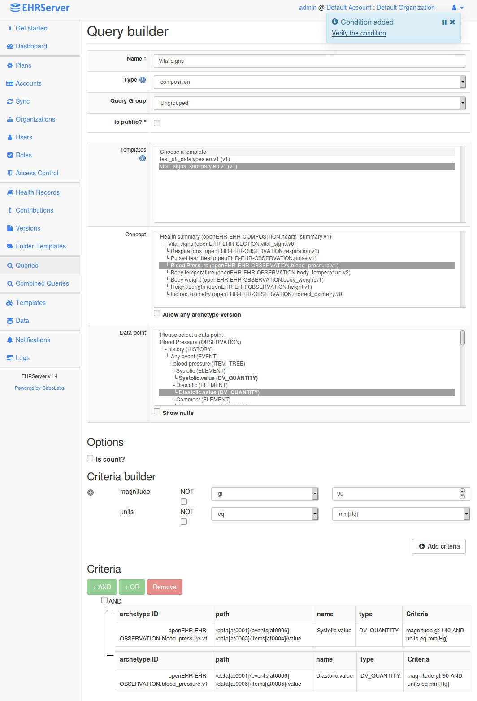

EHRServer is the first open source Clinical Data Management and Sharing Platform, compliant with the [openEHR standard](https://specifications.openehr.org/). Use it as a:

  * Primary clinical data repository for web and mobile clinical apps.
  * Secondary repository for backup or analysis.
  * Centralized repository to share clinical information between many systems.
  * Fast prototyping of new health related apps, removing the need of creating the clinical repo yourself.
  * Main or proxy repository for wearable and other monitoring-based clinical data.
  * Standardized aggregation repository as a data source for ETL to datawarehouses and analytics tools.
  * Research and training clinical data repository.
  * Backend for Clinical Decision Support tools (e.g. rule engines)

EHRServer was designer for developers by developers. You don't need to be an openEHR guru to use it. Easy to install, use, manage and integrate.

# Screenshots

## Dashboard

Quick look at what is happening in the EHRServer.

## Template Manager

Manage clinical document definitions from the Template Manager, defining what data could be stored and queried.

## Query Builder

Very simple point and click query creation in seconds, no programming needed.

## Manage it on the go

Mobile friendly user interface, adapts to small screens.

# EHRServer Architecture (simplified)

## Quick architecture reference

  * REST API provides services to integrate the EHRServer to your systems and apps ([documentation](https://cloudehrserver.com/learn)).
  * Web Console provides a user interfaces for administrators of the EHRServer (check the screenshots above).
  * Query Builder is the component in charge of creating, managing and executing queries over openEHR data stored in the EHRServer.
  * SNOMED Query is a component in charge of processing the terminologic constraints in queries that contain SNOMED CT Expressions. This component is part of the [SNQUERY](https://snquery.veratech.es/) tool developed by [VeraTech](https://www.veratech.es/)
  * EHR Base is where data is managed, indexed, versioned and stored.

# Main features

  * openEHR compliant clinical data repository
  * Administrative Web Console
  * Simple but powerful REST API
  * Supports XML and JSON
  * Full audit access for traceability
  * Versioned clinical documents
  * Query Builder from the Web Console to create data queries (no programming needed!)
  * Support of SNOMED CT Expressions on openEHR queries (simplifies complex queries)
  * Supports any structure of clinical document (following the openEHR standard information model)
  * Vendor Neutral Archive
  * Multitenancy

# Based on Open Source Technologies

  * [Grails Framework](http://grails.org)
  * [Groovy](http://groovy.codehaus.org)
  * [Java](http://docs.oracle.com/javase/specs)
  * [MySQL](http://dev.mysql.com/downloads/mysql/)

# Community

## Support the project!

One way of supporting this project and our vision for building a completely open
e-health platform, is through community donations.
This is used for servers, dev tools, pay for dev time, maintain the website,
updated documentation and guides.

* [10 USD](https://www.paypal.me/cabolabs/10)
* [20 USD](https://www.paypal.me/cabolabs/20)
* [50 USD](https://www.paypal.me/cabolabs/50)

Another way of supporting the project is by [subscribing to the CloudEHRServer](https://cloudehrserver.com/pricing)

Thanks for your support!

## Community support

  * [Let me know if you are using the EHRServer!](https://twitter.com/ppazos)
  * [Asks questions and get support](https://gitter.im/CaboLabs/EHRServer)
  * [Twitter](https://twitter.com/CloudEHRServer)
  * [LinkedIn Group](https://www.linkedin.com/groups/12070397/)
  * [Facebook Group](https://www.facebook.com/groups/ehrserver/)

# Try it

 

## Want to try EHRServer?

  * [Installing EHRServer](https://cloudehrserver.com/learn/try_it)
  * [Subscribe to CloudEHRServer](https://cloudehrserver.com/pricing)

## Quick install, configure, run locally (step by step)

This guide is based on a Linux environment, should be adapted for other OS.

### Dependencies

  1. curl -s get.sdkman.io | bash
  2. source "$HOME/.sdkman/bin/sdkman-init.sh"
  3. sdk install grails 2.5.6
  4. set version by default: Y
  5. grails -version

Note: Grails should be 2.5.6!

### Database

  1. install [MySQL](https://dev.mysql.com/downloads/mysql/)
  2. copy the default root password
  3. cd /usr/local/mysql/bin
  4. ./mysql -u root -p
  5. enter default root password
  6. ALTER USER 'root'@'localhost' IDENTIFIED BY 'NEW-ROOT-PASSWORD';
  8. CREATE DATABASE ehrserver;
  9. exit

### EHRServer configuration

  1. cd ehrserver/grails-app/conf
  2. nano DataSource.groovy
  3. change development password to NEW-ROOT-PASSWORD
  4. save

### EHRServer environment variables

  Mandatory:

      export EHRSERVER_REST_SECRET="6067dba9-1417-41c5-b1af-92208c77ce77"
      export EHRSERVER_SNQUERY_KEY="22222222-2222-2222-2222-222222222222"

  Optional:

      export EHRSERVER_EMAIL_FROM="user@yourdomain.com"
      export EHRSERVER_EMAIL_HOST="mail.yourdomain.com"
      export EHRSERVER_EMAIL_PORT=1234
      export EHRSERVER_EMAIL_USER="user@yourdomain.com"
      export EHRSERVER_EMAIL_PASS="youruserpassword"
      export EHRSERVER_ALLOW_WEB_USER_REGISTER=true

### EHRServer run (dev environment)

  1. cd ehrserver
  2. grails run-app
  3. open http://localhost:8090/ehr
  4. login with admin/admin/123456
